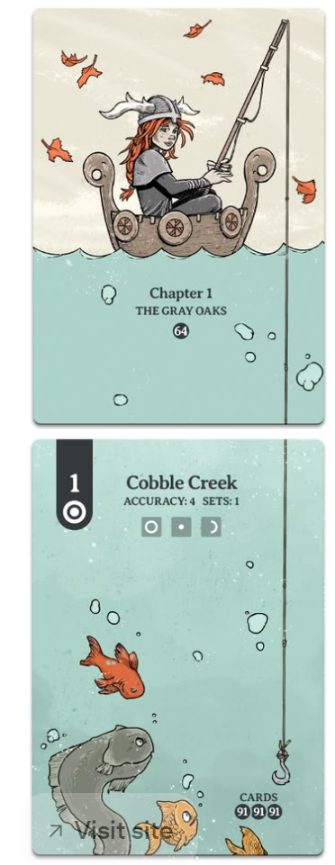

> **One-sentence concept**
>
> A cards-only fishing roguelike where the player descends through increasingly valuable waters, builds a risky chain of catches on the fishing line, and decides when to stop pushing deeper and surface with the haul.

**Status:** Early design. This document captures the mechanics and
direction currently agreed upon; values, balance, exact card counts, and
content are intentionally not final.

# 1. Design pillars

- Cards are the game world. The presentation should feel like a physical
  illustrated card game on a screen, not a conventional game with cards
  layered on top.

- Push-your-luck is the emotional core. Every additional catch and every
  deeper step should make the player ask whether to keep going or cash
  out.

- The catch chain is a temporary build. Caught creatures remain
  mechanically relevant during the descent instead of becoming instant
  currency.

- Weight creates pressure. Valuable catches increase line load, and
  greed should create dangerous but tempting states rather than a simple
  hard inventory limit.

- The deck defines how the player fishes. Basic fishing actions are
  always available; the hand contains techniques that modify, exploit,
  or bend those actions.

# 2. Visual and presentation direction

**The game contains no animated character, explorable sea, or
traditional world view.** Everything important is represented by cards:
the boat/start state, ocean encounters, creatures, treasure, the catch
chain, and the player's techniques.

- Large vertical illustrated cards are the main visual language.

- The fishing line visually connects the boat/start card to caught
  creature cards below it.

- Artwork carries most of the atmosphere and sense of depth; surrounding
  UI should stay restrained.

- Cards should feel collectible and tactile, with clear names, small
  amounts of readable information, and strong illustration.

- Depth and danger can be communicated through card art, card pools,
  labels, and increasingly strange encounters rather than animated
  scenery.

## Visual reference

The provided reference captures the intended feeling: illustrated
vertical cards, a visible fishing line, minimal UI, and the sense that
the card itself contains the world.

# 3. Card architecture

The design uses three functional card groups. This resolves the main
concern about whether the hand should contain creatures or actions.

| **Card / element**     | **Role**                                                        | **Example effect**                                                                                                                                                                        |
|------------------------|-----------------------------------------------------------------|-------------------------------------------------------------------------------------------------------------------------------------------------------------------------------------------|
| Core action cards      | Always available; not shuffled into the deck.                   | Descend, Release, Surface. Encounter commitment happens automatically unless a technique intervenes.                                                                                      |
| Player technique cards | The 4-card hand and build/deckbuilding layer.                   | Bait, reinforced knots, special hooks, descent modifiers, risk manipulation, catch manipulation.                                                                                          |
| Encounter cards        | Drawn/generated by the game according to the current situation. | Creatures, treasure, hazards, environmental situations, opportunities, and unusual discoveries. Catchable creature encounters become Hooked and move into the Catch Chain when committed. |

## Why this split

- The player never becomes unable to perform a fundamental fishing
  action because the correct card was not drawn.

- The hand still matters because technique cards determine how
  efficiently, safely, or unusually the player fishes.

- Ocean creatures remain discoveries rather than choices presented like
  items in a shop.

- Deckbuilding represents the player's fishing strategy, while the catch
  chain represents the temporary state of the current descent.

# 4. Core actions

The game is structured around **actions**, not a separate turn system. A core action resolves one meaningful decision. **Descend** advances the expedition, **Release** changes the Catch Chain without advancing, and **Surface** ends the descent. Technique cards modify these actions or the current encounter.

| **Core action** | **Purpose**                                                                                                                   | **Design rule**                                                                                                                                                                                                            |
|-----------------|-------------------------------------------------------------------------------------------------------------------------------|----------------------------------------------------------------------------------------------------------------------------------------------------------------------------------------------------------------------------|
| Descend         | Move deeper and commit the current Hooked catch to the Catch Chain unless a technique card avoids, redirects, or replaces it. | Always available. Descending is the default way to accept the current catch and continue. Technique cards can alter how far or how safely the player descends, or allow the player to pass an encounter without taking it. |
| Release         | Drop a previously caught creature or item from the line.                                                                      | Reduces load immediately, but permanently loses that card's sale value and any passive/run effect. Release does not advance the descent; the player remains at the current depth and must still resolve the current encounter afterward. |
| Surface         | End the descent and attempt to bring the remaining catch home.                                                                | Everything that successfully returns becomes the player's haul and can be sold/used in progression.                                                                                                                        |

## 4.1 Encounter commitment and Hooked state

Creature encounters are not freely accepted or skipped. When a catchable
creature appears, it becomes the current Hooked encounter. Unless the
player uses a technique or special effect to intervene, continuing the
descent commits that card to the Catch Chain.

- Encountered: the card has been revealed and its information/effect is
  visible according to the current rules.

- Hooked: the creature is attached to the rig as the current unresolved
  encounter. This is the player's reaction window.

- Caught: when the player Descends without avoiding or replacing the
  Hooked creature, it becomes a permanent part of the current Catch
  Chain.

- There is no free universal Skip action. Avoiding an unwanted catch
  requires a technique card, equipment effect, creature effect, or
  another specific rule.

- This allows creatures with meaningful downsides to matter. The ocean
  can give the player an inconvenient catch that must be managed rather
  than simply declined.

# 5. Core run loop

1.  Begin the descent with an empty Catch Chain and a small hand of
    technique cards.

2.  Use Descend to move through deeper encounter pools and advance the
    expedition.

3.  Reveal an Encounter card based on depth, biome, current catches, and
    active modifiers. A catchable creature becomes the current Hooked
    encounter.

4.  Use technique cards during the reaction window to manipulate the
    Hooked encounter, avoid or replace it, change its consequences,
    prepare the line, or alter the next descent.

5.  If the player Descends without an avoidance/replacement effect, the
    Hooked creature is automatically committed to the Catch Chain before
    the next encounter is reached.

6.  The new catch increases Line Load and any passive or downside effect
    may immediately change the run.

7.  Choose whether to keep descending, release an existing catch to
    reduce load or remove its effect, or surface with the current haul.

8.  On surfacing, all surviving cards still attached to the line become
    the haul.

9.  Sell/use the haul, improve equipment/deck options, then begin
    another run.

<table>
<colgroup>
<col style="width: 100%" />
</colgroup>
<thead>
<tr class="header">
<th>
<strong>Core question</strong>

How much value and synergy can I keep hanging from this line before
greed makes the return trip too dangerous?
</th>
</tr>
</thead>
<tbody>
</tbody>
</table>

# 6. Catch chain

Caught creatures do not immediately disappear into an inventory. They
stay attached to the fishing rig while the player continues descending.
The vertical chain of caught cards is both a visual record of the run
and a mechanical system.

- A catchable encounter normally enters the chain by default when the
  player continues descending; avoiding it requires a specific technique
  or effect.

- Every caught card contributes value and usually contributes weight.

- Many caught cards can provide passive effects while they remain
  attached.

- Existing catches can influence what appears next, creating a temporary
  engine during the descent.

- The player is rewarded for assembling useful interactions, but every
  additional catch makes the line harder to manage.

- When a card is released, its weight, value, and active/passive run
  effect are all lost.

## Creature interaction principle

Creatures can join or interact with the line for different thematic reasons:

- Predators may be attracted to previously caught prey.

- Squid and octopus can be attracted to struggling prey, grab a catch,
  or tangle with the rig.

- Crabs or similar creatures can cling to catches or the line.

- Jellyfish or debris may become entangled.

- Treasure and objects can be snagged by the rig.

- Some creatures may alter the value, weight, attraction, or behavior of
  other cards in the chain.

The goal is thematic plausibility, not strict simulation, while supporting
a wide range of creature behaviors and interactions.

# 7. Line load and overload

Weight is the main pressure system. The current working term is Line
Load.

<table>
<colgroup>
<col style="width: 100%" />
</colgroup>
<thead>
<tr class="header">
<th>
<strong>Example display</strong>

LINE LOAD 11 / 10 - OVERLOADED
</th>
</tr>
</thead>
<tbody>
</tbody>
</table>

- Each catch has a weight/load contribution.

- Equipment defines a safe line capacity.

- Going above capacity is allowed. Overload should increase danger
  instead of causing an immediate automatic failure.

- The further above capacity the player goes, the more dangerous certain
  actions can become: continuing to descend, catching another heavy
  creature, or beginning the return/surface process.

- This creates intentional greed states where the player knows the rig
  is unsafe but may still chase one more valuable encounter.

# 8. Releasing catches

Release is the pressure valve for the load system, but it must remain
costly enough that overload still matters.

- The player can release a caught creature/item while still descending.

- Released cards immediately reduce Line Load.

- The player permanently loses the released card's end-of-run value.

- Any passive effect, attraction modifier, synergy, or other run benefit
  from that card disappears immediately.

- Release is not a free inventory operation. Choosing Release does **not**
  advance the descent. The player stays at the current depth, the current
  Hooked encounter remains unresolved, and the player must still decide how
  to deal with that encounter afterward.

- This means a low-value creature can still be painful to release if it
  is enabling an important build interaction.

# 9. Depth and encounters

- Depth is a central progression axis within a run.

- Different depth bands use different Encounter card pools, with deeper
  areas tending toward rarer, stranger, heavier, and more valuable
  encounters.

- Descend is always available as a core action; the deck contains cards
  that modify descent rather than gate it.

- Encounter probabilities can be influenced by bait, current catches,
  technique cards, equipment, and potentially location/biome.

- The ocean should feel like a discovery system: the player manipulates
  encounter conditions and can prepare answers to bad catches, but does
  not freely choose or reject every creature that appears.

## Encounter deck composition

A biome should not be a simple stack of creature cards. The game uses an
Encounter Deck: creatures are only one category of encounter. This keeps
each region active and prevents the repeated decision pattern of “catch
or skip another fish.”

- Creature cards: fish, squid, crabs, predators, and other catchable sea
  life.

- Treasure and salvage cards: cargo, artifacts, wreckage, pearls, and
  other valuable objects.

- Environment cards: currents, reefs, murky water, vents, weather, and
  other conditions that change the current situation.

- Opportunity cards: schools of fish, migrations, feeding frenzies,
  unusual signals, and other temporary advantages.

- Hazard cards: snags, sudden load problems, predators, damaged rigging,
  and other complications.

- Rare or special encounters: unusual creatures, major discoveries,
  mini-boss-style catches, and memorable one-off events.

- Biome-specific cards: encounters that exist mainly to express the
  unique mechanic and identity of that region.

## Biome identity

Each biome should introduce a recognizable gameplay idea, not merely
different artwork and higher-value fish. Entering a new region should
change how the player thinks about the catch chain, risk, or encounter
deck.

- An introductory coastal biome can emphasize schools and simple
  predator attraction.

- A reef biome can emphasize snags, attachments, and interactions
  between caught cards.

- Open ocean can emphasize predators and intentionally carrying smaller
  prey as bait.

- A twilight/deeper biome can emphasize incomplete information and
  uncertain encounters.

- Deep-sea regions can emphasize very heavy catches and unusual load
  manipulation.

- Late-game abyssal regions can deliberately bend established rules with
  strange creature effects.

## Internal progression within a biome

A region should have enough room for the player to experience it before
moving on. To achieve this without requiring an enormous amount of
unique content, each biome can contain several depth tiers whose
encounter pools overlap and evolve.

- Shallow tiers introduce the biome with safer and more common
  encounters.

- Middle tiers add the biome’s core hazards, opportunities, and
  strategic interactions.

- Deep tiers phase out common cards and introduce predators, rare
  rewards, heavier catches, and major encounters.

- Cards can enter and leave the pool gradually rather than every biome
  using one fixed shuffled deck.

This means repeat cards are acceptable when the surrounding state
changes the decision. A Sardine can remain interesting if its low
weight, predator-attraction effect, current Line Load, and the player’s
technique hand create a different reason to keep or release it.

## Biome Apex Encounters

Each biome ends with a special **Biome Apex Encounter**: a rare creature,
treasure, or other major encounter that does not normally appear in the
biome's standard encounter pools. It acts as the climax of that region
and marks the transition into the next biome.

- Apex Encounters should be high-value and mechanically significant, not
  simply larger versions of ordinary creatures.

- Catching an Apex creature can introduce a powerful passive effect that
  changes how the rest of the run is played while that card remains in
  the Catch Chain.

- The reward should usually come with pressure. Apex catches can be very
  heavy, have a downside, or otherwise make continuing into the next
  biome more dangerous.

- The player carries the Apex catch and its consequences into the next
  biome. Entering a new region does not reset the Catch Chain or Line
  Load.

- Apex Encounters should use the same core language as the rest of the
  game rather than becoming traditional combat bosses. The important
  question remains whether the player can afford to keep the encounter
  attached to the line.

- A biome can have multiple possible Apex Encounters, with one selected
  for a particular run. A working target is roughly 2–4 Apex variants per
  mature biome so repeated visits do not always end with the same climax.

The intended feeling is that an Apex catch is simultaneously a
**legendary reward, a temporary run-changing build component, and a new
source of risk**. Catching one should make reaching the next biome feel
exciting rather than simply advancing to a new card pool.

## Encounter chains

Some encounter cards can form short card-only sequences that create a
sense of discovery and mini-stories without animation or a traditional
environment. For example, an ambiguous signal may lead to a shadow and
then to a predator; wreckage may lead to a sunken wreck and then to a
choice of salvage paths.

- Encounter chains should create different choices than ordinary
  creature encounters, not merely delay the reveal of a reward.

- They are especially useful for rare moments, biome landmarks, major
  creatures, and treasure discoveries.

## Content and repetition target

The design should seek systemic replayability rather than solving
repetition only by producing hundreds of unique fish. A working early
content target for a mature biome is roughly 25–35 encounter designs,
with only a subset appearing in any one visit and with different depth
tiers drawing from different subsets. This number is a planning target,
not a locked requirement.

- Roughly 10–15 creature designs.

- Roughly 4–6 environment or hazard designs.

- Roughly 3–5 treasure or opportunity designs.

- Roughly 3–4 rare or special encounters.

- Roughly 1–2 major encounters or biome-defining moments in the regular encounter pool.

- Roughly 2–4 possible Biome Apex Encounter variants, with one used as the biome climax in a given run.

The important measure is decision variety: Encounter Card + Catch
Chain + Line Load + Depth + Technique Hand should combine to make
repeated cards produce different decisions.

# 10. The player deck

The player holds approximately four technique cards. After a technique
card is used, a replacement is drawn according to the final deck rules.

- Technique cards represent bait, special hooks, knots, rigging tricks,
  line reinforcement, descent modifiers, encounter manipulation, and
  other fishing methods.

- The deck should create distinct fishing strategies rather than simply
  provide larger numbers.

- Cards should interact with depth, Line Load, creature tags, the catch
  chain, and risk.

- Fundamental actions should remain outside the deck so bad draws create
  interesting limitations, not basic-function lockouts.

- Some technique cards should specifically provide escape valves for
  mandatory catches: bypassing a Hooked creature, replacing it,
  neutralizing a downside, or releasing it more efficiently.

# 11. Run economy and progression

- Value is realized primarily after the player surfaces, not immediately
  when a creature is caught.

- Only catches still attached/successfully returned become part of the
  haul.

- The haul can be sold for gold and can support later progression such
  as equipment improvements, new cards, deck upgrades, and unlocks.

- Long-term progression should expand strategic possibilities rather
  than only increase raw power.

# 12. Intended player tension

<table>
<colgroup>
<col style="width: 100%" />
</colgroup>
<thead>
<tr class="header">
<th>
<strong>Target feeling</strong>

"I should surface now... but I can probably handle one more
catch."
</th>
</tr>
</thead>
<tbody>
</tbody>
</table>

The strongest decisions should come from conflicts between value,
weight, and synergy. A creature can be worth keeping because it is
expensive, because it enables another creature, because it improves
encounter odds, or because it supports the current deck. Releasing a
card should therefore feel like dismantling part of the run, not merely
cleaning inventory space. The player should also sometimes be forced to
absorb an inconvenient creature and decide whether to build around it,
spend a scarce technique to avoid it, release another catch, or surface
early.

# 13. Prototype scope

The first prototype should test the signature loop before adding a large
content or meta-progression layer.

- 3 permanent core actions: Descend, Release, Surface. Hooking and catch
  commitment are automatic parts of encounter resolution rather than a
  separate basic Catch action.

- A 4-card technique hand and a small technique deck.

- A small Encounter deck/pool with roughly 15–20 cards across creatures,
  hazards, opportunities, treasure, and at least one short encounter
  chain.

- At least 2–3 downside creatures that are undesirable in some states,
  plus several technique cards that let the player bypass, replace,
  cleanse, or otherwise manage a Hooked encounter.

- A visible vertical catch chain.

- One Line Load / capacity system with overload risk.

- Simple passive effects on selected catches.

- A few depth bands with different encounter pools.

- A basic end-of-run haul and sell screen.

- Prototype specifically for decision variety: repeated creature cards
  should still create different choices because of current load,
  catch-chain effects, depth, and the player hand.

<table>
<colgroup>
<col style="width: 100%" />
</colgroup>
<thead>
<tr class="header">
<th>
<strong>Prototype success criterion</strong>

Is it fun to build an increasingly valuable and mechanically useful
catch chain while deciding whether to release something, keep
descending, or surface?
</th>
</tr>
</thead>
<tbody>
</tbody>
</table>

# 14. Still open / not locked

- Exact overload consequences and whether failure happens during
  descent, catching, surfacing, or a combination.

- Whether physical position/order in the catch chain has rules of its
  own (for example, only releasing the lowest catch freely). This is
  promising but should be prototyped before being treated as core.

- Exact number of cards drawn, deck size, discard/shuffle rules, and
  card rarity structure.

- How locations/biomes are selected between runs or during a run.

- How much meta-progression is permanent versus run-specific.

- Exact biome length, depth-tier count, encounter-pool size, and how
  many encounters a typical visit should contain before moving to the
  next region.
